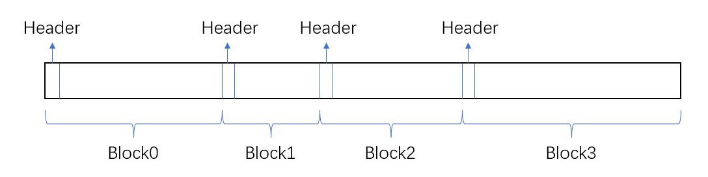
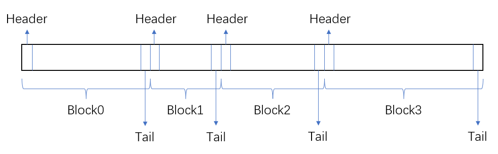
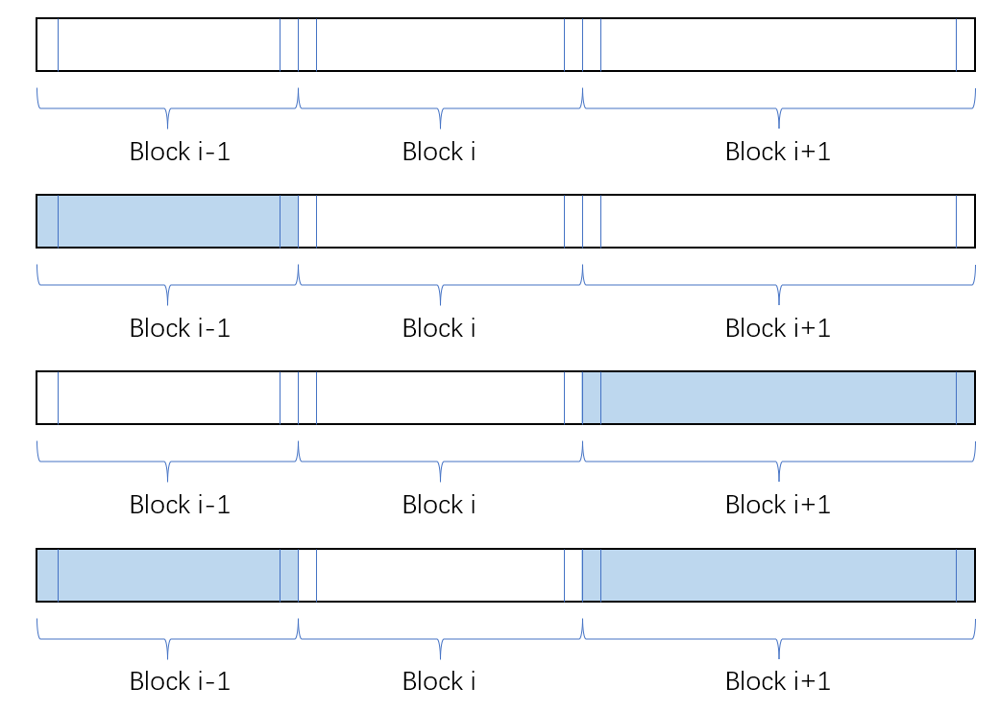
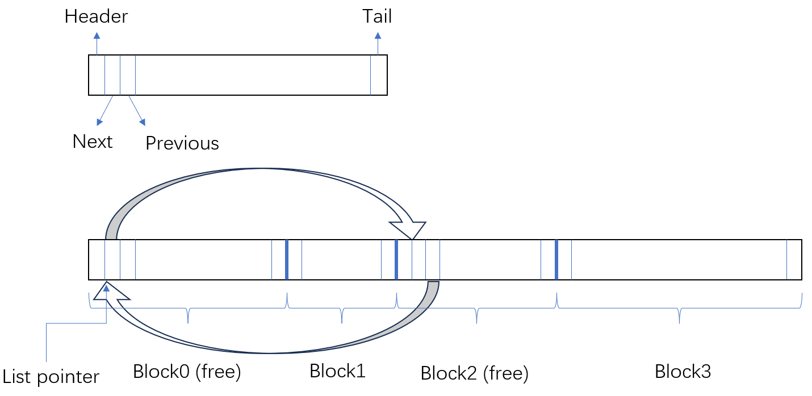

# XJTU-ICS Lab 7: Malloc Lab

## 实验简介

本次Lab你需要实现一个C语言内存管理工具，即手动实现`malloc`、`free`、`realloc`三种函数。为了简化你的实现，我们仅要求前两项，对`realloc`不作要求。但我们仍然提供了测试点来让你测试`realloc`的实现，你可以在下方找到测试它的方法并本地测试。

这个实验对于代码能力要求较高，你需要有强大的耐心，清醒的头脑，并且擅长使用调试有关工具。为此，你需要抓紧时间。

## 内存分配器的具体实现要求

首先来讲，对于一个内存分配器，它必须实现：

1. 能够处理任意的请求，无论应用程序需要释放还是申请，都必须能够响应不得阻塞。
2. 必须调用完就可以返回结果，不得缓冲、异步或者乱序返回结果。
3. 由于它不是静态空间，所以必须只能放置在堆空间内。
4. 内存对齐。在C语言中，任何一种类型都需要对齐访问，例如指向`int`类型的指针第一个字节指向的位置是$4$的倍数（因为`sizeof(int)=4`），同理指向`long long`类型指针地址是$8$的倍数。我们这里要求你`malloc`返回的指针$8$字节对齐。
5. `malloc`与`free`不得移动、修改已经分配的块，若实现`realloc`数据点，则不得修改原有数据，任何空间分配不能与已经分配的块重叠。

你的实现需要有：

1. 尽可能高的响应速度（吞吐量），即应用发出申请内存的请求到获得内存块首地址的速度尽可能快
2. 尽可能高的空间利用率，因为内存分配器还需要回收内存，所以你需要想办法重复利用不再使用的内存空间，而不是一味地使用全新的空间。

## 背景知识1：堆

这里的堆和数据结构课上学到的堆不是一个东西，这里的堆指的是应用程序在内存中的一段空间，与栈类似，用于动态分配空间。这里直接贴一个传送门：[计算机程序内存分布（内存分布情况、五大分区） - 邹木木 - 博客园](https://www.cnblogs.com/zhouhongyuan/p/17627549.html)。

## 背景知识2：内存碎片

容易发现，随着应用不断申请与释放内存，内存中会出现很多较小的未被使用的连续空间，这些空间分布不连续，可能不能被应用于分配较大的空间。这种空间有两类：

1. 外部碎片，这指的是在内存分配时，产生在已被分配的空间之间的未被使用空间，它们的大小不足以支持在里面分配较大的空间。
2. 内部碎片，这指的是分配内存的大小经常会上取整到某一个值，又或者说系统会强制要求最小分配的空间大小，当你要申请的空间小于这个值的时候，会把分配给你的空间强制增加至最小限制，这些由于向上补齐而增加的空间无法再被分配器利用。

## 你可以&不可以使用的工具

### 你可以使用的一些工具

1. 一些有关内存拷贝的函数，你可能会在`realloc`的实现中使用到，如标准库的`memcpy`和`memmove`等
2. 一些数学有关的函数，如$\log$（需要`math.h`头文件）
3. driver中给出的一些允许用来控制堆空间的函数，以下这些你大概率会使用到：
   1. `void *mem_sbrk(int incr)`：把堆的堆顶指针扩展`incr`个字节
   2. `void *mem_heap_lo(void)`：返回当前堆内最低可以访问的字节的地址
   3. `void *mem_heap_hi(void)`：返回当前堆内最高可以访问的字节的地址
   4. `size_t mem_heapsize(void)`：返回当前堆的大小
   5. `size_t mem_pagesize(void)`：返回页的大小（一般来讲是`4KB`，即$2^{12}$字节）

### 你不能使用的工具

1. 系统库自带的`malloc`，这里系统的`malloc`会被评测程序调用，作为你吞吐量的评价标准
2. 任何**数组**类型。显然你可以申请足够大的静态内存做分配，但这显然不是考察的目的。
3. 我们允许但**强烈不建议使用结构体类型**，因为结构体类型隐含有空间对齐问题，除非你能保证它的通用性（我知道可能有人会打`__attribute__((packed))`的主意，但需要知道部分CPU在访问非对齐数据时会发生硬件错误中断，如Cortex-M0处理器的Thumb指令）。我们希望你能够直接使用裸指针读写内存以保障通用性和对空间的极致压缩。在一些更加严格的malloc lab内，结构体被严格禁止。

## 如何测试？

由于每个人拿到的数据点一致，且**测试数据完全公开**，所以我们直接提供完整数据与评测代码的Github链接：[xjtu-ics/malloclab](https://github.com/xjtu-ics/malloclab)，若连接不上我们还提供了Gitee链接：[malloclab](https://gitee.com/Luan-233/malloclab)，两者内容完全一致。

你拿到的Handout应该包含以下文件：

```
├── clock.c
├── clock.h
├── config.h
├── fcyc.c
├── fcyc.h
├── fsecs.c
├── fsecs.h
├── ftimer.c
├── ftimer.h
├── Makefile
├── mdriver.c
├── memlib.c
├── memlib.h
├── mm.c
├── mm.h
├── mm_implicit_free_list.c
├── README
├── short1-bal.rep
├── short2-bal.rep
└── traces
    ├── amptjp-bal.rep
    ├── binary2-bal.rep
    ├── binary-bal.rep
    ├── cccp-bal.rep
    ├── coalescing-bal.rep
    ├── cp-decl-bal.rep
    ├── expr-bal.rep
    ├── random2-bal.rep
    ├── random-bal.rep
    ├── realloc2-bal.rep
    └── realloc-bal.rep
```

你需要实现的函数在`mm.c`内，需要实现四个函数：

1. `mm_init()`：初始化堆，你可以在这里面申请必要的数据，以及初始化一些静态数据。
2. `mm_malloc(size)`：申请至少`size`字节的空间，并返回首个字节的指针，和`malloc`功能一致
3. `mm_free(*ptr)`：和`free`功能一致
4. `mm_realloc(*ptr, size)`：和`realloc`功能一致

我们提供了若干测试文件（在`./trace`目录下方），**这些测试文件就是你最终评测使用的测试文件**（我们允许且鼓励你面向数据编程，但任何时候都需要保证它是一个能被通用的内存管理工具），每个文件会提供一个包含有`malloc`，`free`和`realloc`的操作序列，驱动器会按照顺序模拟这个申请与释放的请求，最后会把你的吞吐量和C库的`malloc`做对比。

在整个测试系统中，**我们保证任何时候单次申请的数据小于$2^{32}$字节**。

我们使用此公式给你打分：$Score = 60\%(Util)+40\%\min\{1,\frac{T}{T_{libc}}\}$

其中$Util$是你的空间利用率（计算方式为$\frac{有效载荷大小}{总堆大小}$），$T$是吞吐量（单位时间内完成操作的平均数量）。


首先你需要编译这个程序，在文件目录下执行：

```
make
```

即可构建评测程序。这个可执行应用程序是`mdriver`。我们修改了`Makefile`的内容，使得你能够使用GDB进行调试。你可以执行`./mdriver -h`来查看如何使用。你可以执行以下代码来测试你的程序：

```
./mdriver -V -t ./traces/
```

对于`mm.c`中给出的一版最初的实现，对它评测得到的结果如下：

```
Team Name:ateam
Member 1 :Harry Bovik:bovik@cs.cmu.edu
Using default tracefiles in ./traces/
Measuring performance with gettimeofday().

Testing mm malloc
Reading tracefile: amptjp-bal.rep
Checking mm_malloc for correctness, efficiency, and performance.
Reading tracefile: cccp-bal.rep
Checking mm_malloc for correctness, efficiency, and performance.
Reading tracefile: cp-decl-bal.rep
Checking mm_malloc for correctness, efficiency, and performance.
Reading tracefile: expr-bal.rep
Checking mm_malloc for correctness, efficiency, and performance.
Reading tracefile: coalescing-bal.rep
ERROR: mem_sbrk failed. Ran out of memory...
Checking mm_malloc for correctness, ERROR [trace 4, line 7673]: mm_malloc failed.
Reading tracefile: random-bal.rep
ERROR: mem_sbrk failed. Ran out of memory...
Checking mm_malloc for correctness, ERROR [trace 5, line 1662]: mm_malloc failed.
Reading tracefile: random2-bal.rep
ERROR: mem_sbrk failed. Ran out of memory...
Checking mm_malloc for correctness, ERROR [trace 6, line 1780]: mm_malloc failed.
Reading tracefile: binary-bal.rep
Checking mm_malloc for correctness, efficiency, and performance.
Reading tracefile: binary2-bal.rep
Checking mm_malloc for correctness, efficiency, and performance.

Results for mm malloc:
trace  valid  util     ops      secs  Kops
 0       yes   23%    5694  0.000024237250
 1       yes   19%    5848  0.000024245714
 2       yes   30%    6648  0.000027249925
 3       yes   40%    5380  0.000022240179
 4        no     -       -         -     -
 5        no     -       -         -     -
 6        no     -       -         -     -
 7       yes   55%   12000  0.000039306122
 8       yes   51%   24000  0.000070340426
Total            -       -         -     -

Terminated with 3 errors
```

由于它只申请内存不释放，故导致内存申请过多无法通过所有的评测。

若想测试一个单独的文件（例如，这里测试第一个测试点`amptjp-bal.rep`），你可以执行：

```
./mdriver -V -f ./traces/amptjp-bal.rep
```

它会输出：

```
Team Name:ateam
Member 1 :Harry Bovik:bovik@cs.cmu.edu
Measuring performance with gettimeofday().

Testing mm malloc
Reading tracefile: ./traces/amptjp-bal.rep
Checking mm_malloc for correctness, efficiency, and performance.

Results for mm malloc:
trace  valid  util     ops      secs  Kops
 0       yes   23%    5694  0.000023247565
Total          23%    5694  0.000023247565

Perf index = 14 (util) + 40 (thru) = 54/100
```

就可以看到单个测试点的性能评分。

## 从链表开始

我们希望使用一种数据结构，把所有的已经分配的块和未分配的块通过某种形式串起来，使得我们能够通过这个数据结构获知所有块的信息。

一个很直观简洁的数据结构就是链表，当然了这里的链表和数据结构课上学的差别比较大，传统意义上的链表结点大小固定，记录有一个指向下一个链表结点的指针，并且可能带有一定的负载数据。但这里我们并不记录指针，且负载长度（分配出去的空间大小）是不固定的，用图来表示内存结构就是这样的：



这里的`Header`是一个固定长度的字段，它记录了整个块的长度`Length`（负载+头部大小），且记录了这个块是否被使用。这样的话，可以通过指针的形式来遍历每个段，以此来寻找一个合适大小的空块。

这样做的优点是，假如说当前指向负载第一个字节的指针为`p`，那么通过把`p`向前移动固定长度（`sizeof(Length)`）并读取，就可以获得负载长度`Length`，再把`p`增加`Length`就可以获得下一个块的负载首字节地址，这是不是有一些链表的感觉了？

上文说了，每一段的负载长度都不会超过$2^{32}$，所以可以用一个长度为$4$字节的头存储。同时，为了便于组织数据（这个原因详见合并空闲块）和保证字节对齐，我们强制让负载长度变为$8$字节的倍数，这也就意味着`size`的末$3$位为$0$，借助这三位可以存储当前块是否被占用，我们这里选用最低位的二进制位（即位权为$2^0$的二进制位），若为$1$则代表这个块被占用，$0$代表空闲。

## 寻找空闲块

在`malloc`中，当我们找到一些块大小大于等于负载长度的时候（以下简称为OK的块），就可以选择把其中一个块的前半部分占用。我们选择块的策略有这些：

1. 首次适配：找到的第一个OK的块分配
2. 最佳适配：找到在所有OK的块当中，将大小最小的那个分配
3. 下一次适配：记录上一次分配的块地址，从上一次分配的块开始向后，寻找第一个OK的块分配。若最后一个块不OK，那么再从头开始寻找。

我们选择的策略是首次适配。首次适配具有较好的搜索速度，易于实现，但是可能产生较多碎片。

## 空闲块的分割

当寻找到一个合适的块的时候，你需要把其中的一部分分割出来提供给应用程序使用。但如果这个空闲块很大，并不会把整个块全部占用，所以你需要把没用上的部分分割出来，填写上必要的数据（包括但不限于`Header`）供后面申请使用。

## 合并空闲块

由于反复的释放会导致大量的空闲块，而若两个空闲块在内存上连续排布，那么很显然可以把这两个块合并到一起，便于后面分配给更大的负载。

当释放一个块的时候，获知下一个块的信息很方便，但是获取上一个块需要从头开始遍历，这是极其影响吞吐量的操作。我们想在常数时间内获得上一个块的数据，那么一个很智慧的想法是这样的：在块的末尾补上一个和`Header`一样的数据，供下一个块访问。这个概念是由Knuth老爷子提出的。我们称这个数据为尾部`Tail`（CSAPP上也称这个数据为`Foot`脚部，两者含义一致）。

那么我们就可以这样分配实际的内存：



这样做的好处就是：能够快速获取上一个块的信息，并且能够与$8$字节对齐，具体而言，由于头部占$4$字节，这也就意味着对于一个后分配的块，头部前的$4$字节一定会空出来，那么现在可以把前一个块的尾部和当前块的头部组织到一个$8$字节对齐的，大小为$8$字节的块，这样的话我们直接按照$8$字节为单位去分配内存（把需要申请的空间大小向上取到$8$的倍数），就能减少很多特殊判断。

我们需要考虑四种情况：

1. 前后都是空闲块
2. 前面的块被使用，后面的块是空闲块
3. 前面的块是空闲块，后面的块被使用
4. 前面的块被使用，后面的块被使用

分别对应以下四种情况：



其具体的解决方案会在隐式空闲链表章节内提到。

## 申请新的空间

当堆已经不够用的时候，就需要扩展堆的大小以容纳更多的数据。 这里你需要调用`mem_sbrk`函数申请。这个`mem_sbrk`的本质就是把堆顶向上扩展了`size`个字节，也就是说新申请到的空间与原有空间是内存上连续的。

在CSAPP上，每次申请新的空间大小至少为`4K`，这是常规状态下页表的大小，我们一次不会申请太多空间，否则空间利用率会很低。当然也不能少，空间一次性申请足够后可以保证短时间内不会用完，因为实际上从操作系统中索要空间这件事是很耗时的。

补充知识（和解决本lab没有联系）：Linux下`malloc`存在两种不同方式申请内存，一种通过调用`brk`实现，另一种通过调用`mmap`实现，后者需要经历从用户态切换至内核态再切换回来的过程，时间开销较大。

由于空间连续，且新申请到的内存是空闲块，所以需要检查一下新申请的块前面是否是空闲块，如果是的话，你需要把它们合并成一个大块。

## 隐式空闲链表的实现

### 便于你写代码的宏定义

为了便于你写代码，我们可以定义这样的宏（参照了CSAPP中的定义方式）：

```c++
//Header的大小
#define WORD_SIZE (sizeof(unsigned int))

//用来在Header上写数据或者读取值
#define READ(PTR) (*(unsigned int *)(PTR))
#define WRITE(PTR, VALUE) ((*(unsigned int *)(PTR)) = (VALUE))

//将块大小和是否被占用的信息合并，便于写入Header
#define PACK(SIZE, IS_ALLOC) ((SIZE) | (IS_ALLOC))

//传入指向Header的指针p，返回其后的负载块的长度
#define GET_SIZE(PTR) (unsigned int)((READ(PTR) >> 3) << 3)
//传入指向Header的指针p，返回其后的负载块是否被占用
#define IS_ALLOC(PTR) (READ(PTR) & (unsigned int)1)

//传入指向负载首个字节的指针，返回指向这个块的头/尾的指针
#define HEAD_PTR(PTR) ((void *)(PTR) - WORD_SIZE)
#define TAIL_PTR(PTR) ((void *)(PTR) + GET_SIZE(HEAD_PTR(PTR)) - WORD_SIZE * 2)

//传入指向负载首个字节的指针，返回指相邻的下一个块/上一个块的指针
#define NEXT_BLOCK(PTR) ((void *)(PTR) + GET_SIZE(HEAD_PTR(PTR)))
#define PREV_BLOCK(PTR) ((void *)(PTR) - GET_SIZE((void *)(PTR) - WORD_SIZE * 2))
```

其实把它们组织称函数的原理也是一样的。但使用宏减少了函数调用开销，（可能）可以提高吞吐量（部分编译器可能会执行小函数自动内联）。

由于直接在内存空间上操作极其容易出错，且由于没有任何结构体等供你使用，所以调试较为困难，你可以参照书上的代码来实现你的程序。你当然也可以按照自己的理解实现。

### 初始化的实现

我们首先实现`mm_init()`，在程序内我们可以提前定义好两个块放在最开始和最后，令它们的状态为已经分配，这样若发生空闲块合并，就不需要考虑边界情况（即某个块是第一个块或最后一个块）。在此前提下，称提前定义好的第一个块为序言块（与书上的名字一样），它同时具有块的头部与尾部且负载长度为$0$，所以总的大小为$8$字节。结尾块则不需要考虑这些，我们直接令它的大小为$0$。这样做的好处是：我们从序言块开始顺次遍历所有的块，通过把当前块的指针增加块的大小来跳转到下一个块。当我们检测到一个块的长度为$0$的时候（也就是遇到了结尾块）就可以认为遍历结束了。因此序言块的总大小需要大于$0$，因为若序言块大小为$0$则会变成死循环（或者说直接被判定为结尾块退出）。

按照这样的实现，申请的基础数据应当长这个样子：

```
| 一个4字节的空数据 | 4字节的序言块头（写入的值为 8 bitor 1 = 9） | 4字节的序言块尾 | 4字节的空结尾块（边界，写入的值为 0 bitor 1 = 1） |
```

然后你的指向第一个块的指针就指向上面那个$4$字节的序言块尾。容易发现它指向的是一个已经被分配的块，并且它始终不会被释放，且能够通过跳转跳转到下一个块。这就是一个减少边界处理的巧妙思路。

另外，`mem_sbrk`第一次申请所得的内存一定是$8$字节对齐的，所以你可以放心大胆地去申请。

### 辅助函数的定义与功能

为了易于实现你的`malloc`，我们提前定义一些辅助函数，这些辅助函数的功能有：合并空闲块（下文称`merge`，在CSAPP教材内称这个函数为`coalesce`），在空闲块内分配内存并将剩余部分维护为小空闲块（`place`）。

`merge`函数传入一个指向空闲块负载部分的指针，并将前后的空闲块（若存在）与之合并。考虑`merge`需要实现什么，合并空块需要获取前后块的状态和大小，计算出最终的空块大小，并写把元数据写回。一个较为方便的方法（便于后续实现其他的功能）是，我们令`merge`函数的返回值为**指向最终合并得到的空闲块的负载的指针**。

考虑`place`函数需要实现什么，因为前面提到了若空闲块较大而分配出去的空间较少，那么剩余的部分就应当被分割出来供后续分配使用。但若剩余部分过小而不能再继续分配空间，那就把整个块都分配出去。这里这个阈值是$8$字节，因为$8$字节只够分配一个头部与一个尾部，无法分配内容。

### malloc与free的实现

在此就可以开始实现你的`malloc`函数了。`malloc`需要你执行对齐判断，寻找适配的块，随后将空闲块切分，分配给应用程序。当不存在一个块的大小大于等于申请的空间，你就需要调用`mem_sbrk`申请扩充堆空间大小。

`free`也就很好实现了。容易发现你只需要设置好标志位然后检测一下前后的块是否可以合并即可。你若想实现一个基础的`realloc`，你只需要执行一遍`malloc`然后把数据拷过去就行了。它的优化实现会放到后面聊。

**特殊的，为了降低你的代码难度，助教为你写好了隐式空闲链表的多数代码与逻辑说明（注释），详见文件`mm_implicit_free_list.c`**，基于这些你只需要实现三个部分：

1. `merge`函数的全部，它传入指向一个空闲块的负载部分第一个字节的指针，你需要将这个空闲块与前后的空闲块合并，并返回指向合并后的空闲块的负载部分第一个字节的指针。
2. `place`函数的全部，它传入指向一个空闲块的负载部分第一个字节的指针，以及需要从中分割出多少空间，你需要把分割出的一段或两段空间填写好相应的头部与尾部。
3. `malloc`函数的首次适配，它传入需要的空间大小，你需要从头开始逐块遍历，寻找到第一个块使得它的空间大于等于需求空间。若寻找到则返回指向这个空闲块的负载部分第一个字节的指针，否则返回空指针。

实现了这些功能后，助教本人的实现实测可以拿到$75 \pm 1$分。性能评分可能会有波动，但对最终分数影响不大。

## 优化为显式空闲链表

容易发现，上面的实现遇到的问题就是，每当遍历一个块的时候，首先就需要看这个块是否被使用，如果这个块已经被使用，那么这次检查就被白白浪费了。特别是与首次适配相结合的时候，堆空间前方会有大量的碎片与被使用的块，极大地降低了检索的效率。

一个考量是：我们不需要记录所有的已经被使用的块，只需要**记录所有未被使用的块**。但这些未被使用的块在空间上分布并不连续，所以可以进一步借用链表的思想，在每个空块内显式记录两个指针，分别指向链表内下一个空块与前一个空块。



这也就意味着一个空闲块至少有$2\times(4+\text{sizeof}(\text{void*}))=24$字节大小（若为$32$位操作系统则为$16$字节大小，但现在应该都是$64$位操作系统了），你需要把小于$16$字节的负载扩展至$16$字节。

在这里你需要额外实现一些函数，比如`remove(ptr)`函数，表示从空闲链表中把当前空闲块删除；`insert(ptr)`表示把一个空闲块插入空闲链表等。

你需要注意的细节有：执行`merge`的时候需要执行`remove`删除前后的空闲块；若`place`传入的参数是一个空闲块指针，则执行`place`的时候需要先删除当前空闲块，随后把剩余的部分再`insert`回来；`malloc`从堆内新申请的空间在合并完后需执行`insert`，等等。这些都为了保证链表的逻辑正确。（你也可以自行实现，但需要保证逻辑与结果正确）

助教本人的实现实测可以拿到$90$分。

## 优化为分离式显式空闲链表

容易发现显式空闲链表的问题在于，它依然使用首次分配，但众所周知最佳分配能够取得比首次分配更好的空间利用效率。如果能够实现一个链表，把同样大小的空闲块分门别类串起来，那么这会很方便做最优适配，但这个空间开销是显然不能接受的。

我们希望通过一些略微粗糙的方法来近似实现最优适配。那么我们可以给每个链表大小按照一定的大小来分类，也就是说大小在某个区间内的空闲块组织到一个链表内，这里选择$[16,32)$，$[32,64)\dots$这样分类。在这个基础上从小到大遍历链表做首次适配即可。

你可以通过$\lfloor \log_2(size) \rfloor$获取其所属的分类编号。这也就意味着你需要额外的空间（$32\times \text{sizeof}(\text{void*})$字节）来存储每类链表的头指针，这部分静态空间的申请放到`mm_init`内实现。

助教本人的实现实测可以拿到$92$分。

## 面向数据点的编程1

对每个数据点单独测试发现，使用了分离式显式空闲链表，无法拿到更高分数的瓶颈在于`binary`测试点、在这里我们着重优化`binary`测试点，那么我们观察`binary1`测试点的含义，会发现在前半部分，它申请/释放的过程是这样的：

```
申请一个64字节大小的空间
申请一个448字节大小的空间
申请一个64字节大小的空间
申请一个448字节大小的空间
...
释放第一个64字节大小的空间
释放第二个64字节大小的空间
...
申请一个512字节大小的空间
申请一个512字节大小的空间
...
```

最开始每两次操作都会申请$512$字节大小的负载，但若顺序分配，清空$64$字节大小的被使用块会产生大量的碎片，这些碎片两两不相邻，且无法被更大的空间所占用。这也就是为什么采取了分离式链表也无法达到更高分数的原因。很明显这个测试点专门攻击的就是你的`place`函数。那么一个思路就是把所有的$64$字节空间尽可能分配到一起，$448$字节的空间放在一起。那么怎么才能做到这样？

我们可以把每次从堆中申请的空间放大一些，这样的话分配剩下的空闲块就会集中在堆内部。我们令$64$字节大小的块置于前侧，$448$字节大小的块置于后侧。也就是说，我们希望堆空间的占用是这样的：


你可以根据数据特性选择一个合适的阈值来决定多大的块置于哪一侧。

由于这些$64$字节的块需要凑出至少一个大小为$512$字节的连续快，那么$64$字节的块就需要$\frac{512}{64}=8$个，这样的话每次申请的块的总空间占用就达到了$(64+448)\times 8 = 4096$也即$4K$（每个$64$字节的`malloc`后面都会跟随一个$448$字节请求），这样的话就相当于求出来一个`mem_sbrk`传参的下界。两个`binary`测试数据的分析方法一样。

虽然这个是面向数据编程，但由于**测试数据完全公开**，所以我们鼓励这种行为。因为实际工程中，提取出数据的相应特性并针对特性优化也是很常见的行为。

实现了上面这一切后，助教本人的实现可以拿到$98$分。

## 如何提交？

在目录下方执行`make submit`即可得到一个你需要提交的文件。

这个文件的命名是：`你的用户名-handin.zip`，里面仅包含你实现的`mm.c`文件。你也可以手动打包它（按照要求的格式命名），提交这个压缩包至在线学习平台即可。

**注意，你需要保证每个测试点都能够正常通过，否则会被直接判定为零分！**

你可以通过问答平台提问，或者以邮箱的方式联系助教（负责此实验的助教的邮箱luan_233@stu.xjtu.edu.cn）。你可以针对逻辑询问任何问题，以及上报任何评测漏洞，但请不要问代码问题，即不要让助教帮助你逐行调试代码。

由于实现难度较高，这个Lab我们给出三周的时间。迟交策略保持不变。

## （选做）优化realloc的实现

我们的最终评测不包含`realloc`测试点，你若想自行测试，则需要在`config.h`文件内添加宏`#define REALLOC_TEST_ON`。

最开始的`realloc`实现过于朴素，无法利用当前块的前后空闲块，来减少扩堆次数。堆空间越大，你的空间利用率也就越低。我们希望`realloc`借助前后的空块来扩展。当然，你只实现这个部分并不能提高你很多分数。

在空间上，若前后相邻的块是空块，那么显然可以把前后的空闲块加以利用。我们对这个块执行`merge`，然后把原有负载移动到新负载上（两者**可能有空间重合**，所以你需要使用`memmove`函数），以及执行`place`维护数据。（这里仅仅是助教本人的写法，我们鼓励按照自己的理解实现）

特别的，你需要时刻注意空闲块最开始的$16$字节的信息（即空闲链表指针）可能会在一些情况下被抹除，又或者原先的数据会被链表指针覆盖（助教的实现是：将空闲块与前后合并后，会在`merge`函数内将新块作为空闲块插入空闲块链表，那么若前一个块不是空闲块，则最开始的$16$字节空间会写入空闲块指针，污染原数据）。所以你需要把这些数据事先存下来，最后再写入。

另一个可能的坑是，移动负载数据前不要使用`place`函数分割空间，这可能会导致新产生的块的尾部或者头部位于原负载范围内，进而污染原数据。driver在执行`realloc`后会判断数据移动后是否保持不变，若数据发生了变化则此测试点不得分。

基于分离式显式空闲链表，助教本人的实现实测可以拿到$88$分。若基于面向数据点编程1，则可以拿到$95$分。

## （选做）面向数据点的编程2

在面向数据点编程1中，我们优化了`binary`测试点，现在你会发现瓶颈在于`realloc`测试点，现在的`realloc`仍然是一个很朴素的实现，你可以参照面向数据点的编程思路来分析它的数据特性，然后优化你的实现拿到更高的分数。

我们以`realloc1`测试点为例，观察它的数据：

```
alloc id=0 size=512
alloc id=1 size=128
realloc id=0 size=640
alloc id=2 size=128
free id=1
realloc id=0 size=768
alloc id=3 size=128
free id=2
realloc id=0 size=896
alloc id=4 size=128
free id=3
realloc id=0 size=1024
alloc id=5 size=128
free id=4
realloc id=0 size=1152
alloc id=6 size=128
free id=5
realloc id=0 size=1280
alloc id=7 size=128
free id=6
...
```

容易发现它就是在不断重复以下过程：

```
把第一次申请的空间扩容128字节
申请一个大小为128字节的空间
把上上次申请的128字节空间释放
```

容易发现如果你只是紧凑地分配空间，每次扩容都有可能会被新分配的空间卡住（`realloc`后紧跟一个`alloc`），但每次都会把上上次分配的空间释放，我们需要设计一个新的空间分配算法来利用这段空间。

一个可能可以的思路是：我们把第一个段分配的空间额外增加$128$字节，这段空间作为预留空间仅仅供`realloc`扩容使用。那么每次执行扩容都会利用上这$128$字节，随即紧跟其后的$128$字节被释放，形成新的预留空间，如此循环，就能够保证`realloc`完美利用这段空间。唯二可能的碎片就是这$128$字节和最后由于`mem_sbrk`产生的空闲块。

助教本人并没有实现这个数据点，仅提供一个可能的思路。你可以从面向数据编程的思路出发，提升你的函数在这个测试点的性能，取得比助教更高的分数。

Good luck and have fun。 -- Luan_233

## Flowers

